# 宠物用品商城系统(文末免费领取☟)
> 
#### 介绍
宠物用品商城系统(Java_SpringBoot)
有BUG可留言加微

#### 软件架构
Java + SpringBoot + Mybatis + Mysql

#### 项目功能说明

1.  管理员功能
> + 宠物用品信息
> + 首页配置：宠物用品轮播图配置、热销宠物用品配置、宠物用品新品上线配置、为你推荐宠物用品配置
> + 管理模块：宠物用品分类管理、宠物用品信息管理、用户信息管理、宠物用品订单管理
> + 系统管理：修改密码、安全退出
2.  用户功能
> + 登录注册
> + 商品分类
> + 商品详情页
> + 购物车
> + 我的订单
> + 订单详情

### 部分功能演示

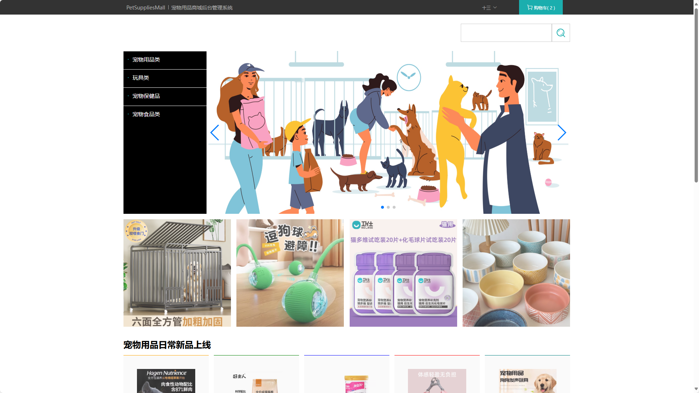
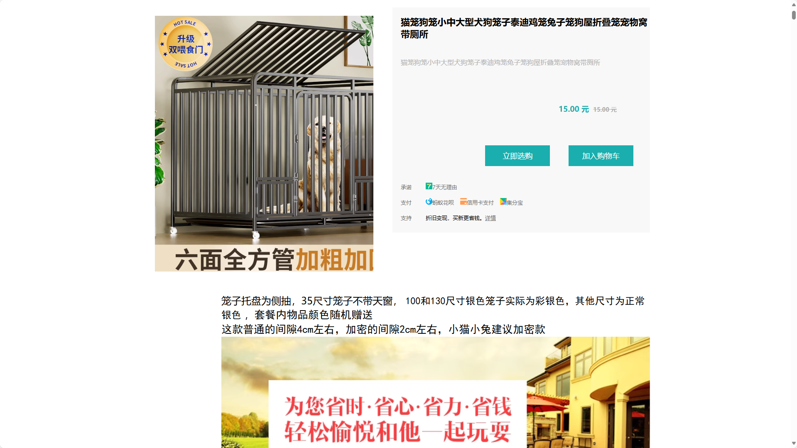
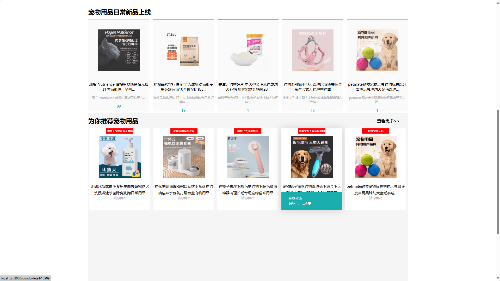
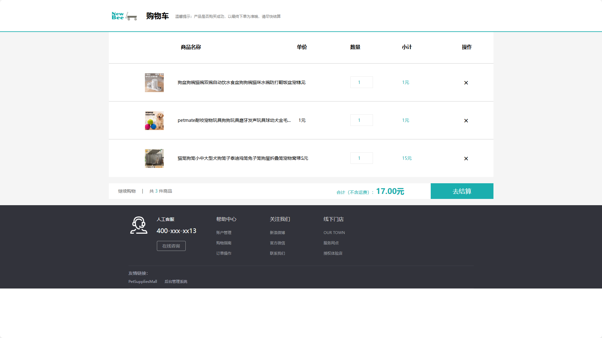
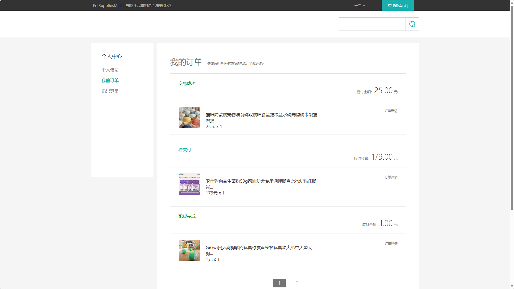
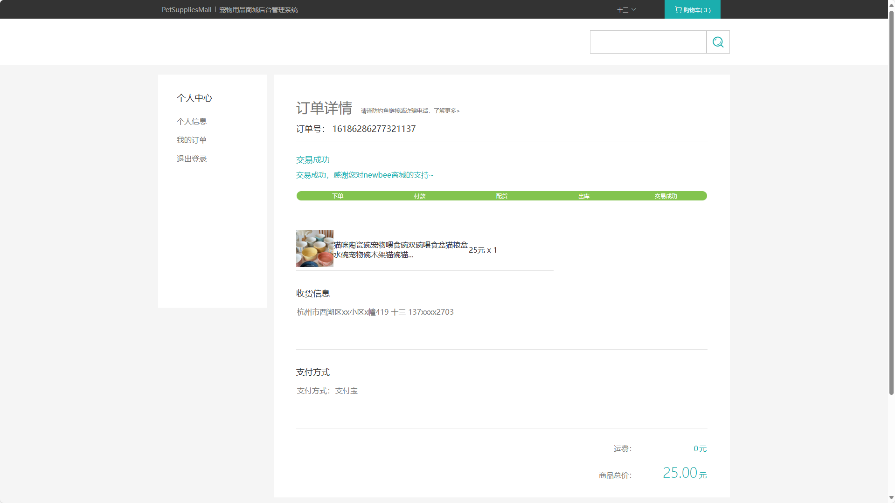
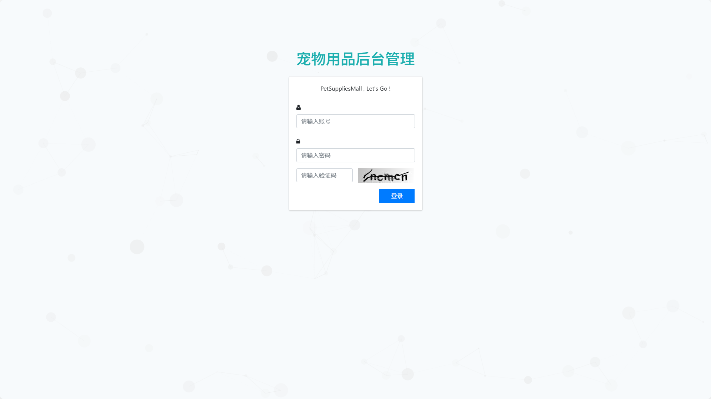
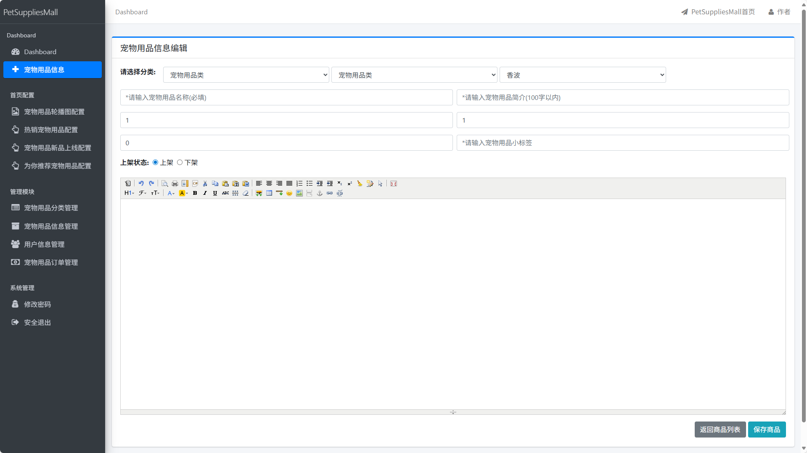
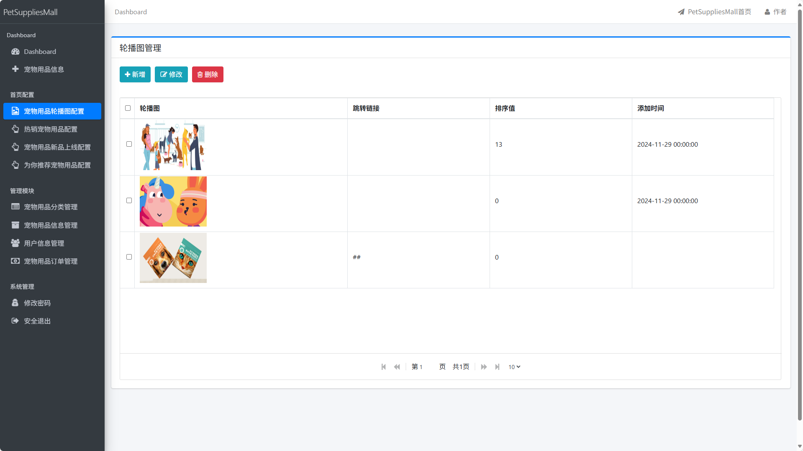
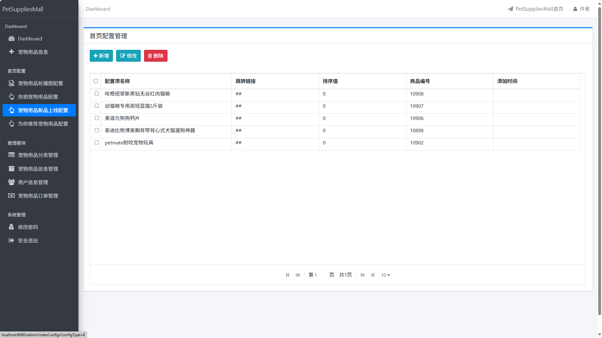
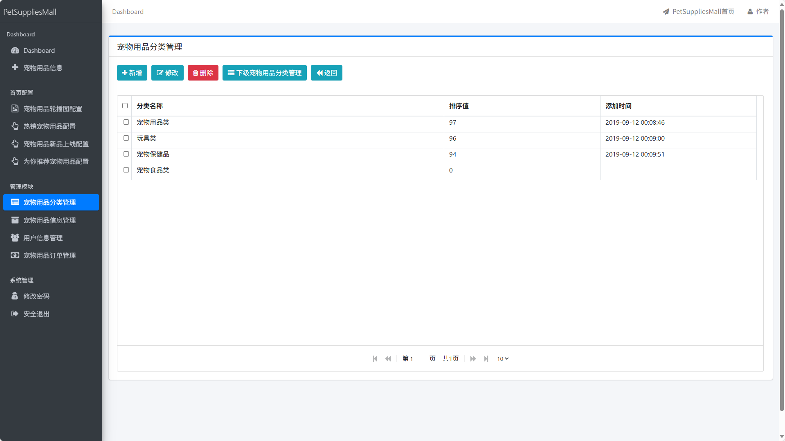
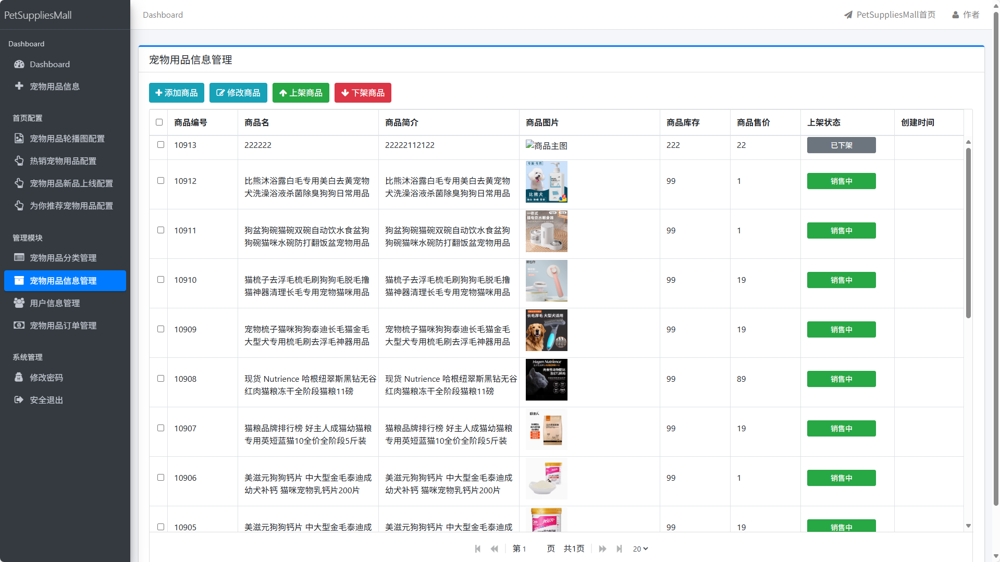
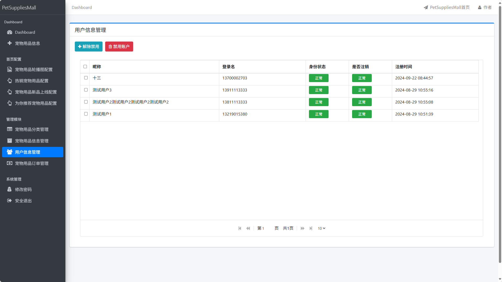
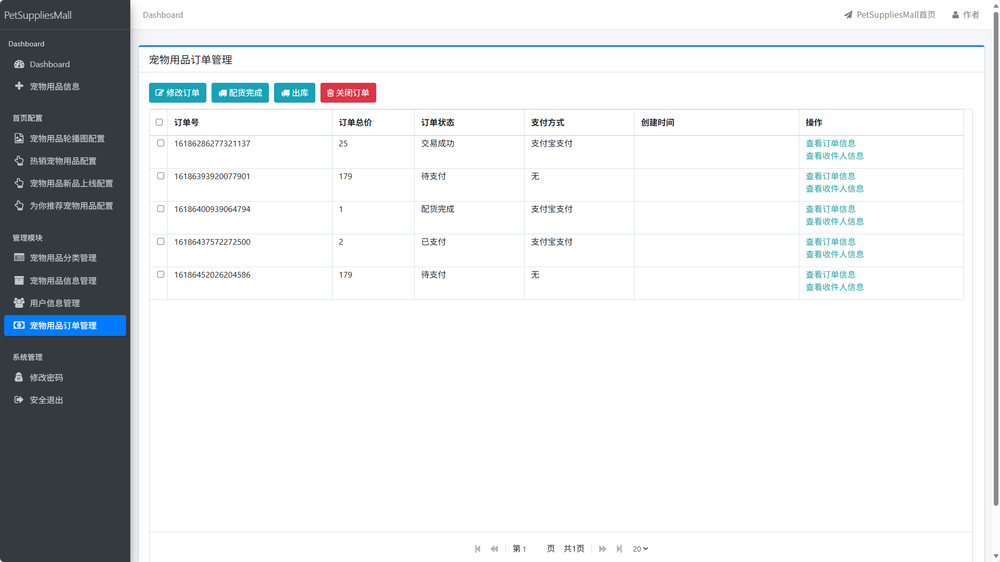

### 环境需求(可免费提供)
- idea/eclipse、jdk-1.8、maven-3.8.6、mysql、node.js等

## 有项目修改、安装调试需求 请联系以下

## 获取资源扫☝☝☝

